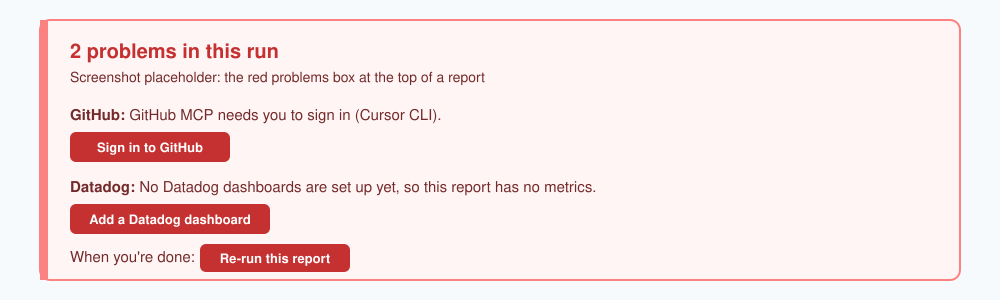

# Engineering Pulse

[](https://github.com/seek-oss/engineering-pulse/actions/workflows/ci.yml)

Engineering Pulse gives an engineering manager two daily reports about the team:

- The **Engineering Pulse report** shows system health from Datadog, the pull requests that wait for review, and your own tasks.
- The **sprint report** shows the progress of your Jira sprint, with burn-up and burn-down charts, the progress of each epic, and the scope changes.

The Cursor agent on your Mac collects the data and writes the reports. You do not write code.


## What you get

- **A daily Engineering Pulse report.** It shows the latest value of each Datadog widget that you select, plus the GitHub pull requests that wait for you or your team. When you add a dashboard, you set a red, yellow and green threshold for each metric. The tile then shows the colour.
- **A daily sprint report.** It shows what is done, what remains, and what was added to or removed from the sprint. You need the Atlassian MCP server and one sentence about your board. See [Sprint report](docs/features.md#sprint-report).
- **A schedule.** By default, the reports run at 09:00 and 18:00, Monday to Friday. To change the days and times, or to pause one report, use **Settings** on the report calendar.
- **A notification.** macOS tells you when a new report is ready. Email is optional.
- **A report calendar.** All reports stay on your Mac. You can see what changed between two reports.
- **A problems box.** If a data source fails, the report still comes. A red box at the top tells you what failed. Many problems have a button that fixes them.

Optional features: a summary of what your stakeholders said in Slack (Glean), and your Todoist tasks.
See [Optional features](#optional-features).

## What you need

| Item | How to check |
|------|--------------|
| A Mac | The schedule, notifications and buttons use macOS. |
| Python 3.11 or newer | `python3 --version` |
| `git` | `git --version` |
| **Cursor** and the **Cursor CLI** (the `agent` command) | `agent --version` |
| The **Datadog** and **GitHub** MCP servers, added in Cursor | `agent mcp list` |

An MCP server is a connection that lets the agent read data from a tool, for example Datadog.
You sign in to each MCP server one time. You do not put API keys in a file.
[docs/install.md](docs/install.md#1-get-the-prerequisites) tells you how to install the Cursor CLI and add the MCP servers.

## Install in 5 steps

1. Open Terminal and run the installer:

   ```bash
   curl -fsSL https://raw.githubusercontent.com/seek-oss/engineering-pulse/main/web-install.sh | bash
   ```

   The installer asks which agent to use. Select **Cursor CLI**. It installs to `~/.engineering-pulse`.

2. Make sure that the MCP servers are in Cursor's MCP config, then sign in.

   The Cursor CLI reads servers from `~/.cursor/mcp.json` (your user config) or from `.cursor/mcp.json` in a project. Ask your platform team for the company MCP config, or add the servers in the Cursor app under **Settings**, then **MCP**. See [Cursor MCP](https://docs.cursor.com/context/mcp).

   Then check the names and sign in. A server that shows `requires_authentication` needs a sign-in. These are the usual servers:

   ```bash
   agent mcp list
   agent mcp login Datadog      # dashboard metrics (necessary)
   agent mcp login GitHub       # pull request review queue (necessary)
   agent mcp login Atlassian    # sprint report from Jira
   agent mcp login Glean        # Stakeholder Pulse from Slack
   ```

   Use the names that `agent mcp list` shows. They can be different on your Mac. Each login command opens a browser window. Sign in, then go back to Terminal.

3. Put your team names in `~/.engineering-pulse/.env`.

   The installer already copied `.env.example` to `.env`. That copy still has placeholder values, so the reports cannot use it yet. Open the copy and replace the placeholders with your teams:

   ```bash
   open -e ~/.engineering-pulse/.env
   ```

   If `.env` is not there, copy it yourself, then open it:

   ```bash
   cp ~/.engineering-pulse/.env.example ~/.engineering-pulse/.env
   ```

   Change these two lines:

   ```bash
   DATADOG_TEAMS=your-datadog-team
   GITHUB_TEAM=your-github-org/your-team
   ```

   For the sprint report, change `SPRINT_BOARD` to one sentence about your Jira board (see [Sprint report](docs/features.md#sprint-report)). If you do not use Jira sprints, put `#` at the start of the `SPRINT_BOARD` line.

4. Add one Datadog dashboard. Copy the dashboard URL from your browser. Then start the Cursor agent in `~/.engineering-pulse`:

   ```bash
   cd ~/.engineering-pulse
   agent "Follow skills/engineering-pulse/references/add-dashboard.md to add this dashboard: <dashboard URL>"
   ```

   The agent shows the widgets on the dashboard. Tell it which widgets you want in the report. Then confirm or change the red, yellow and green threshold that it proposes for each metric.
   You can also use the Cursor app: open `~/.engineering-pulse` and type `/add-dashboard <dashboard URL>` in the chat.

5. Make your first report:

   ```bash
   cd ~/.engineering-pulse && make run
   ```

   The run takes 2 to 5 minutes. A notification tells you when the report is ready.

For more detail, read the [installation guide](docs/install.md).

## Daily use

### Scheduled reports

At each scheduled time, Engineering Pulse makes the reports in the background. You do not have to do anything.
When a report is ready, a macOS notification shows. Select the notification to open the report on the report calendar.

### Make a report now

Run one of these commands in `~/.engineering-pulse`:

| Command | Result |
|---------|--------|
| `make run` | Makes all scheduled reports now. Terminal shows the progress. |
| `ENGINEERING_PULSE_ONLY=pulse make run` | Makes only the Engineering Pulse report |
| `ENGINEERING_PULSE_ONLY=sprint make run` | Makes only the sprint report |
| `make run-bg` | Makes the reports in the background. You get a notification when they are ready. |
| `make reports` | Opens the report calendar |
| `make logs` | Shows the run log while a run continues |
| `make help` | Shows all commands |

### Use the report calendar

- **Read old reports.** Select a day to read its reports.
- **See what changed.** Above each report, a bar tells you what changed since the previous report.
- **Change the schedule.** Select **Settings**. Change the days and times, then select **Apply**.
- **Compare two reports.** Select **Compare**. The agent writes a short summary of what changed.


## Optional features

The report shows a **"✦ N more features"** badge when optional features are off. Select the badge to see how to turn them on.

| Feature | What it adds | What you need |
|---------|--------------|---------------|
| [Sprint report](docs/features.md#sprint-report) | Burn-up and burn-down charts for your sprint | Atlassian MCP and `SPRINT_BOARD` in `.env` |
| [Stakeholder Pulse](docs/features.md#stakeholder-pulse) | One card per person: what they said and asked for in Slack this week | Glean MCP and `STAKEHOLDERS` in `.env` |
| [My Queue](docs/features.md#my-queue-todoist) | Your Todoist tasks and reading list | `TODOIST_API_TOKEN` in `.env` |
| [Email](docs/configuration.md#delivery) | The report in your inbox | A Gmail App Password and `DELIVERY=email` |
| [Extras](docs/features.md#extras) | Your own notes as cards in the report | A Markdown file in `prompts/extras/` |

## If something goes wrong

The report always comes, also when a step fails.
A red box at the top of the report shows each problem. Select **Sign in** or **Add a Datadog dashboard** to fix it, then select **Re-run this report**.



The run log is `/tmp/daily-dashboard.log`. For more help, read [Troubleshooting](docs/troubleshooting.md).

## More information

| Guide | Content |
|-------|---------|
| [Installation guide](docs/install.md) | Prerequisites, MCP servers, first run, upgrade, uninstall |
| [Features](docs/features.md) | Report sections, calendar, Compare, sprint report, Stakeholder Pulse, Todoist, extras |
| [Configuration](docs/configuration.md) | All `.env` settings, schedule, delivery |
| [Troubleshooting](docs/troubleshooting.md) | The problems box and common problems |
| [Development](docs/development.md) | How it works, scripts, tests |

Your data stays on your Mac. Reports, dashboards and `.env` are not part of git, and an upgrade does not change them.

## Contributing and licence

Read [CONTRIBUTING.md](CONTRIBUTING.md) to run the tests and open a pull request.
Engineering Pulse uses the [MIT licence](LICENSE).
