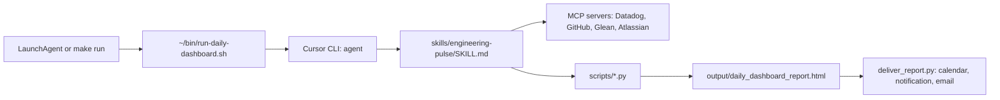

# Development

This page is for people who want to change Engineering Pulse. To use it, read the [Installation guide](install.md).

## How it works

Engineering Pulse is driven by an agent and a skill. The workflow is Markdown instructions that the agent follows. Python scripts are tools that the agent calls.



- The runner prepares the problems file, checks the MCP sign-ins, and starts the agent with the skill.
- The agent gets the data through the MCP servers and calls the scripts to make the report.
- `deliver_report.py` adds the problems box, puts the report on the calendar, and sends the notification or email.
- `make run` and the schedule must start the agent through `AGENT_CLI`. Do not replace this with a Python-only pipeline. `scripts/run_daily_dashboard.py` is for debugging only.

## Folders

```
skills/engineering-pulse/   the daily workflow (SKILL.md + references/)
skills/sprint-report/       the sprint report skill
skills/report-compare/      the compare skill
harness/                    commands and notes for each agent (Cursor commands in harness/cursor/)
AGENTS.md                   rules for agents in this repository

prompts/dashboards/         your dashboards (custom_*.md, not in git; _example.md is in git)
prompts/extras/             your extra cards (not in git, except _example.md)

scripts/
  datadog_dashboard_extract.py   Datadog widgets and values
  github_prs.py                  PR review queue (GitHub MCP, or GITHUB_TOKEN)
  todo.py                        Todoist tasks and reading queue
  render_daily_dashboard_html.py the Engineering Pulse HTML report
  extras_plugin.py               extras and stakeholder cards
  run_issues.py                  the problems of the current run, MCP checks
  issue_box.py                   the red problems box
  fix_link.py                    the box buttons (engineering-pulse:// links)
  deliver_report.py              calendar, notification, email
  report_archive.py              the report calendar and manifest
  report_snapshot.py             data for the "what changed" view
  compare_reports.py, run_compare.sh   compare two reports
  settings.py, schedule.py       calendar Settings and the LaunchAgent
  install_url_handler.sh         the engineering-pulse:// button app
  notify_report.py               macOS notifications
  send_report_smtp.py            email
  lib/agent_cli.sh               starts the selected agent for scheduled runs

output/                     all data and reports (not in git)
```

## Run the scripts directly

```bash
# Datadog values for one dashboard
.venv/bin/python scripts/datadog_dashboard_extract.py \
  --url 'https://app.datadoghq.com/dashboard/abc-123/my-dashboard' \
  --output-slug my_dashboard --days 7

# PR review queue (needs GITHUB_TOKEN when you run it outside the agent)
.venv/bin/python scripts/github_prs.py

# Make the HTML report from the data in output/
.venv/bin/python scripts/render_daily_dashboard_html.py

# Put a report on the calendar and notify or email (per DELIVERY)
.venv/bin/python scripts/deliver_report.py send --type pulse output/daily_dashboard_report.html

# Email only
.venv/bin/python scripts/send_report_smtp.py "My subject" output/daily_dashboard_report.html
```

For all arguments, see [`env-and-paths.md`](https://github.com/seek-oss/engineering-pulse/blob/main/skills/engineering-pulse/references/env-and-paths.md).

## Tests

```bash
python3 -m venv .venv && .venv/bin/pip install -r requirements.txt
.venv/bin/ruff check scripts tests
.venv/bin/ruff format --check scripts tests
.venv/bin/python -m pytest tests/ -q
bash tests/test_agent_cli.sh
```

CI runs the same checks for each push and pull request. For the pull request process, read [CONTRIBUTING.md](https://github.com/seek-oss/engineering-pulse/blob/main/CONTRIBUTING.md).

## Rules for changes

- Do not put tokens, org URLs or team names in tracked files. Use `.env`.
- Use fictional names, orgs and hosts in examples and tests.
- A change in behaviour needs a test.
- Workflow text goes in `skills/`. Scripts stay small.
