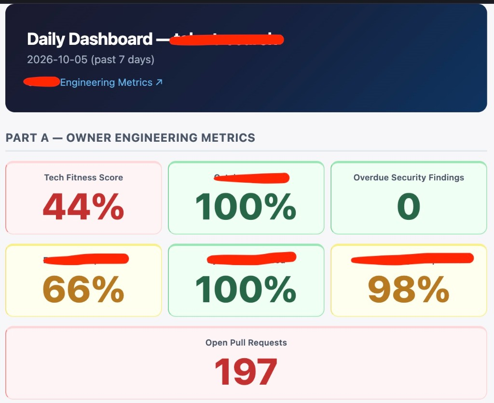
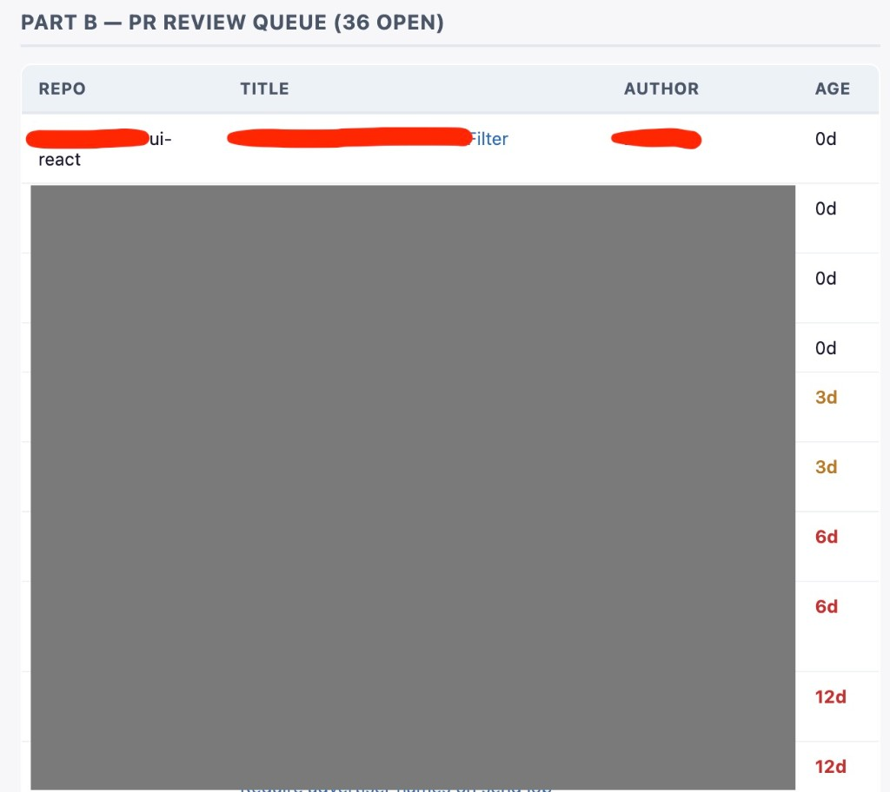
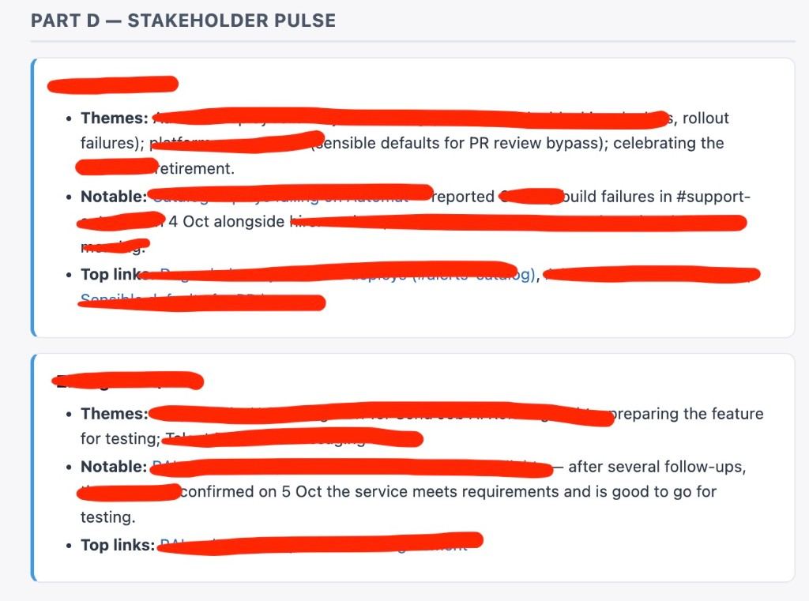
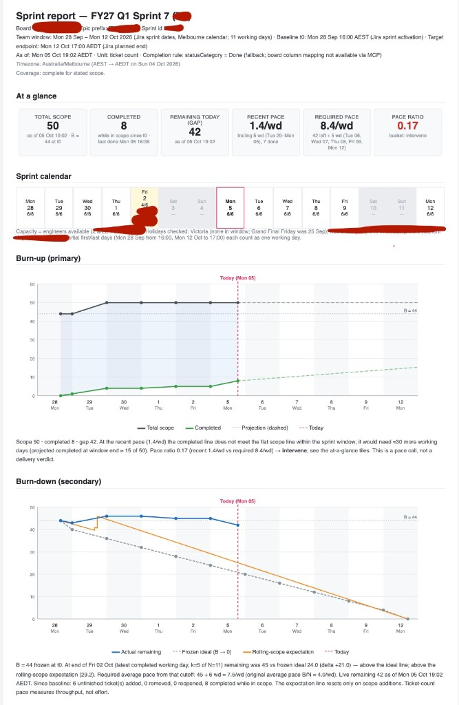
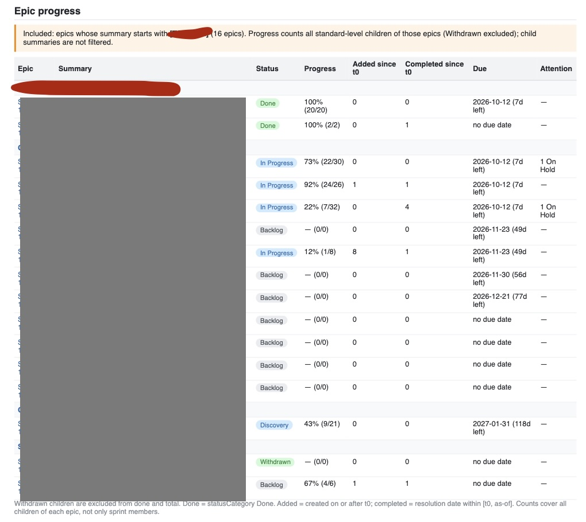
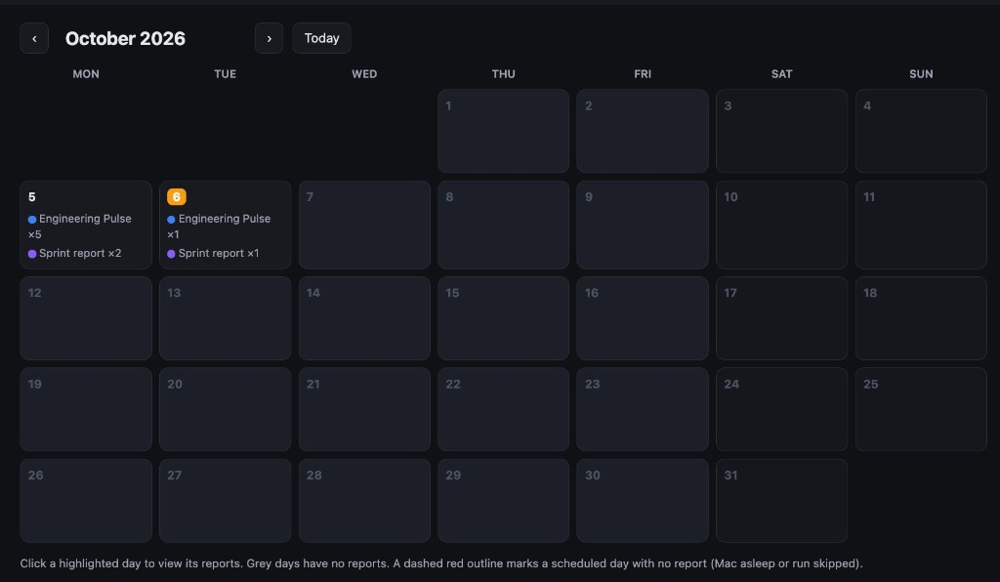

# Report examples

These examples come from real reports. Team names, people and internal details are
redacted.

## Engineering Pulse report

### Team health from Datadog

See the latest value for each selected metric. The thresholds that you configure make
risks red or yellow and healthy values green.

### Pull requests that wait for review

See the repository, title, author and age. Older requests use stronger warning colours,
so review bottlenecks are easy to find.

### Stakeholder Pulse

See the main themes, one notable update and the top links for each stakeholder from
public Slack channels indexed by Glean.

## Sprint report

### Delivery position and forecast

See total scope, completed work, remaining work, recent and required pace, the sprint
calendar, and burn-up and burn-down charts.

### Progress by epic

See status, completion, work added and completed since the baseline, due dates and
items that need attention.

## Report calendar

See every Engineering Pulse and sprint report by day. Select a day to read its reports,
see what changed, or compare two runs.

